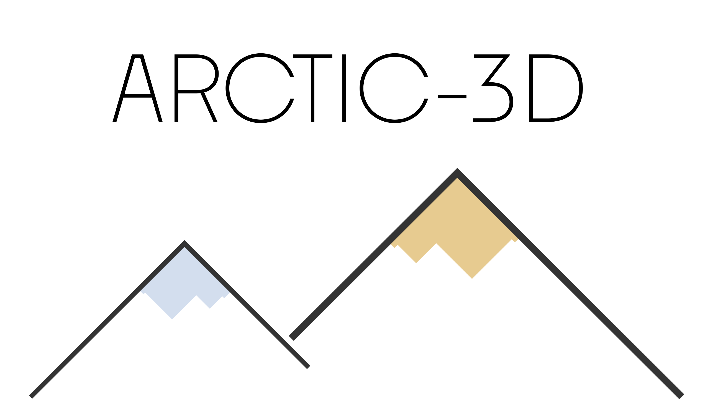

# ARCTIC-3D

[](https://github.com/haddocking/arctic3d/actions/workflows/.lint.yml)
[](https://github.com/haddocking/arctic3d/actions/workflows/unittests.yml)



**A**utomatic **R**etrieval and **C**lus**T**ering of **I**nterfaces in Complexes from **3D** structural information

---

## Developing

Check [DEVELOPING.md](DEVELOPING.md) for more information.

## Installation

### With `conda`

```bash
conda create -n arctic3d python=3.10
conda activate arctic3d
pip install .
arctic3d -h
```

## To run BLAST locally

```bash
bash install_blast_deps.sh
```

And put `blastp` in your `$PATH`.

## Example usage

Please refer to the [examples](docs/examples.md) documentation page.

## Detailed documentation

In order to generate a detailed html documentation please execute these commands

```text
pip install myst_parser
conda install sphinx
sphinx-build -E docs ./arctic3d-docs
```

Then you can open the file `arctic3d-docs/index.html`, which contains all the necessary documentation.
