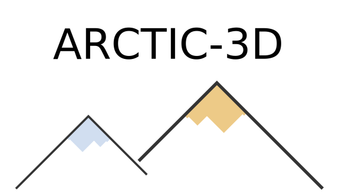

# ARCTIC-3D

[](https://github.com/haddocking/arctic3d/actions/workflows/.lint.yml)
[](https://github.com/haddocking/arctic3d/actions/workflows/unittests.yml)



**A**utomatic **R**etrieval and **C**lus**T**ering of **I**nterfaces in Complexes from **3D** structural information

---

## Developing

Check [DEVELOPING.md](DEVELOPING.md) for more information.

## Installation

### With `conda`

```bash
conda create -n arctic3d python=3.10
conda activate arctic3d
python setup.py develop
arctic3d -h
```

## Example

---
